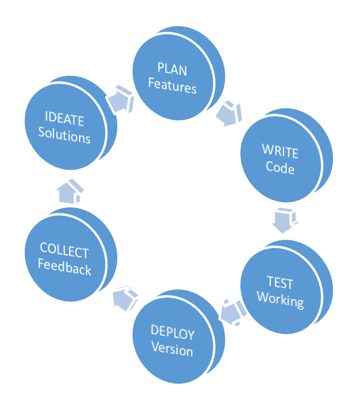
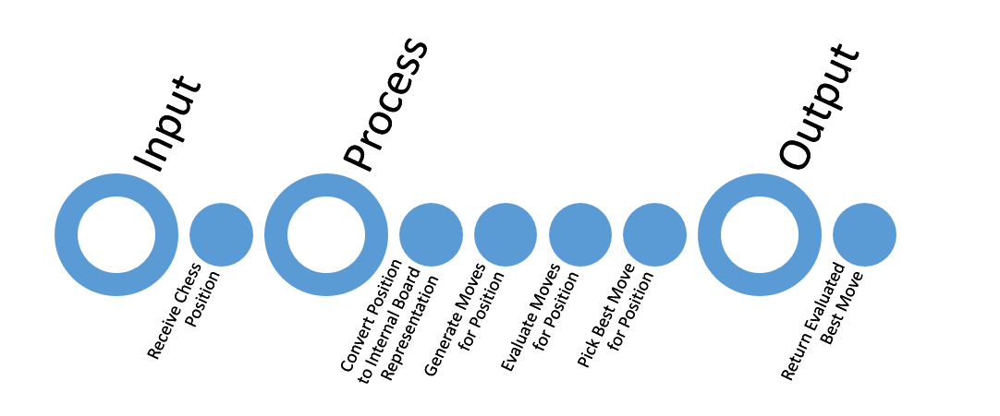

#Building a Chess Engine: A Primer
When building a piece of software, we never start with code. That's why you'll notice that
even though we have a few commits already, we have never actually committed any code. We
always start with a plan. I have a personal software development cycle which goes roughly
like this:

First things first: know about [chess](https://en.wikipedia.org/wiki/Chess). Or, skip it
entirely and follow on. We will be getting into the details when we want to start writing code
anyway. But, it always helps to know.

What we do know is that our chess engine will need to know chess if it is to evaluate moves. So
the first thing we have to do is to build a board representation to use inside the engine. And
it must be bug-free, and must know and follow every rule of chess. It can be troublesome,
especially when we have little to no knowledge of chess itself, but it is in a sense
the backbone of our engine and we simply have to get it right.

To make sure we build a solid board representation that knows the ins-and-outs of chess and its
many rules, one of our first tasks will involve creating a(n internal) debugging framework. As
we are inclined to write a lot of tests, as should any software project which hopes to live
long, it shouldn't pose any extraordinary problem for us. Still, it helps to know what tasks
lie ahead of us in this wonderful journey we are prepared to take.

Once the board representation is complete, we need to put the 'brains' in the engine. That will
be search and evaluation, the fun stuff.

We then need a UI to connect and get inputs from and give outputs to. We can cook up a GUI, but
thankfully, we have GUIs with some communication protocols we can take advantage of. So we will
not be building a GUI, but will make use of existing GUIs using a communication protocol named
UCI.

Since the tasks outlined here vary in complexity, let's take them one at a time.

We are going to:

1. Build a board representation.
2. Test the board representation.
3. Build knowledge about rules of chess into our engine.
4. Test the rules of chess built into our engine.
5. Build a debugging framework to test our representation and rules.
6. Write as many unit tests as necessary.
7. Use UCI as the communication protocol to accept a chess position as input.
8. Interpret the chess position as our internal board representation.
9. Use the board representation and rules to generate a valid move as a response.
10. Return the valid move as the best move to the GUI via the UCI communication protocol.

And we haven't even touched upon search and evaluation, finding the best move, etc.

But I'm sure we'll have our hands full with these 10 tasks for quite some time. And because we
will be using SOLID principles, adding in the search and evaluation at a later time will not
be as difficult as you might think, even though it is a huge change. And I want you to
experience it first hand, which is why we're postponing it. Once we get everything else right,
we can keep tuning the search and evaluation without any hindrance.

That's it, folks. We have a long road ahead of us, but I'm confident we'll get there. And
celebrate.

_Cheers to us!!!_

##Further Information

* [Chess on Wikipedia](https://en.wikipedia.org/wiki/Chess)
* [Getting Started on Chess Programming](http://chessprogramming.wikispaces.com/Getting+Started)
* [Board Representation](http://chessprogramming.wikispaces.com/Board+Representation)
* [UCI Communication Protocol](http://chessprogramming.wikispaces.com/UCI)
* [Recommended Reading](http://chessprogramming.wikispaces.com/Recommended+Reading)
