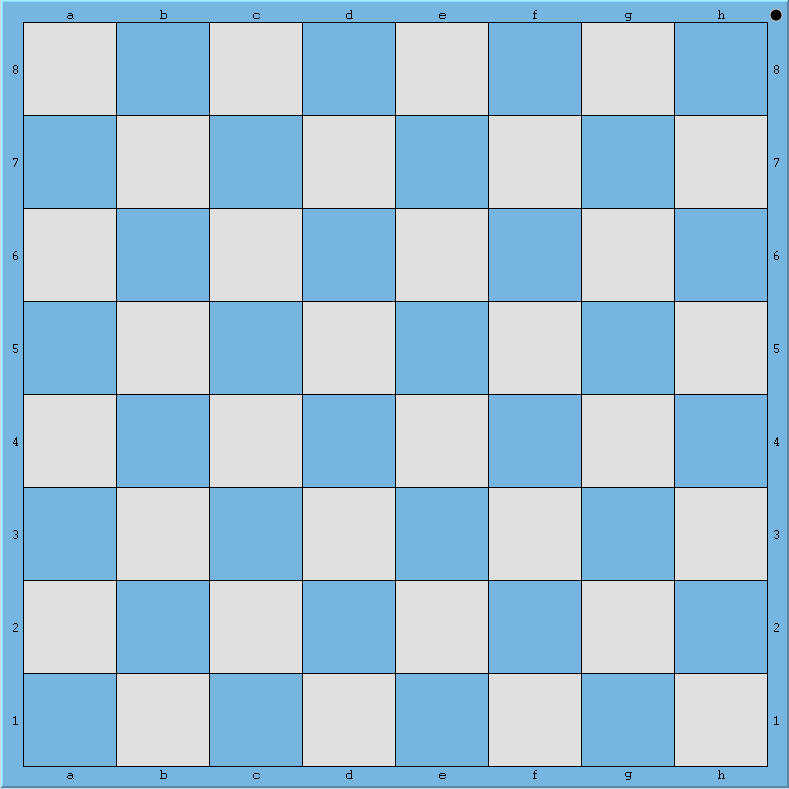

#The Chess Board
The Chess Board is a board with an 8x8 grid of alternating light and dark squares. We can have an
image of the board for easier understanding:

Since our images follow the blue-white scheme, I thought that would be a nice fit. The blue squares
represent the dark squares while the light grey ones represent the light squares.

In the chess board, we have some unique notations and nomenclature that we must familiarize
ourselves with. The board is made up of alternating *light* and *dark* *square*s, which are the
cells of the gird.

##Ranks and Files
We can see that the rows and columns have numbers and letters next to them, as a notation or a
way to name or reference them. In the chess board, the rows are called *rank*s and the columns
are called *file*s. The ranks are numbered and the files are alphabetized. We can see that are 8
ranks from 1 through 8 and 8 files from a through h.

We can reference them using the numbering and alphabets. As an example, the second *rank* from the
bottom can be referenced as *rank 2* or *2nd rank*. Similarly the second *file* from the right can
be referred to as the *g file*. This is important. We call them rank numbers and file names.

##Squares
Just as in a grid or table, rows and columns intersect at cells, the ranks and files of a chessboard
intersect at *square*s. A square can be referred to on a chess board by rederring to the file and
rank to which it belongs. Let's take an example. The square on the board second from bottom and
second from right, belongs to the *g file* and *rank 2*. It is therefore referred to as the *g2
square*.

Try pointing out the *e4*, *d5*, and *b7* squares to get familiar with this reference. To recap, a
square is referred to by combining the file name and the rank number. And the chess board contains 64
squares, ranging from a1 through a8, b1 through b8, and likewise, to h1 through h8.

##Representations
There are several representations of a chess board in computers. But we are going to build our own
representation from scratch with what we know, and keep refining it until we reach a point where it
encompasses everything needed for our requirement. This method will also pave the way to learning
about:

* proper thinking
* sticking to what we know
* avoiding premature optimization
* refactoring big changes without getting caught up, etc.

And the best part is that we will have a lot less hiccups going forward, as we are using SOLID
principles. As we pick on choices, we will investigate what else we could have done, and why we have
chosen/avoided certain design approaches. It is through this that we can understand how good software
and code materializes. And we will do it together.

##Further Information
* [Chessboard](https://en.wikipedia.org/wiki/Chessboard)
* [Board Representation](https://en.wikipedia.org/wiki/Board_representation_(chess))