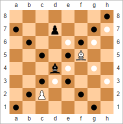

# The Chess Pieces

In our last journal entry, we aligned our board representation (constructed with what we know) with our
goals for this project and made the module more SOLID. Now that the board is complete, we move on to
other important things. Let's start with the pieces. I hope you remember the board from our [Board
journal entry](03%20-%20The%20Chess%20Board.md). With the chess pieces placed on the board in the
starting position, it looks a bit like this:

Now that we know how to reference the squares, ranks and files on the board, it is going to be easy for
us to talk about the pieces. At first glance, we can make the following observations:

* The chess pieces occupy (are placed in) squares on the chess board.
* A single piece occupies a single square.
* Some squares are blank, i.e., some squares are not occupied by any piece.
* There are a total of 32 chess pieces.
* 16 of them are white, the other 16 are black.
* There are 6 unique pieces
    1. The ones in the ranks 2 and 7
    2. The ones in the squares a1,h1,a8, and h8
    3. The ones in the squares b1,g1,b8, and g8
    4. The ones in the squares c1,f1,c8, and f8
    5. The ones in the squares d1 and d8
    6. The ones in the squares e1 and e8
* The pieces are in two sets, one in black and one in white, and are arranged symmetrically on the board.

There are two sets of pieces, one in black and one in white, one set for each *player*. Chess is a
2-player game, that is, it is played by two players. This starting position is how a game is started.
From this position, the players move their pieces on the board in order to play. One of them uses the
white pieces to play, and the other uses the black pieces. Playing is done by moving pieces from one
square on the chessboard to another. Knowing that much about players, moves and the game is enough for 
the moment, let us concentrate on the pieces themselves.

As we noted earlier, there are 6 unique chess pieces. Let us identify and name them. This is important,
because in chess, each piece moves differently, and being able to refer them by name has its advantages
while discussing / learning chess moves and rules. The pieces also have a notation which is a single
character to identify them. It is written in upper case for denoting a white piece and in lower case for
denoting a black piece (neat, eh?).

White Piece|Black Piece|Name|Notation White|Notation Black|
-----------|-----------|----|--------------|--------------|
||King|K|k|
||Queen|Q|q|
||Rook|R|r|
||Bishop|B|b|
||Knight|N|n|
||Pawn|P|p|

Pooling what we know so far, we can roughly see the characteristics of what we could call a *Piece*:

* A single piece can occupy a single square on the chess board
* A piece has a name which denotes its type
* A piece has a colour which denotes its side (of play)
* A piece has a notation which is derived from both the name and the colour
* A piece can be moved from one square to another (by the player)

## Pieces and Moves
In chess, as we talked about earlier, players play by moving their pieces on the chessboard from one
square to another. Pieces and moves are linked in a way, that the type of piece determines the available
moves, because each piece moves in a certain way. As we learn more about the types of moves available to
each piece, we may have to incorporate more features into our board in order to facilitate the generation
of such moves. Le's have a look at the possible moves of all the pieces.

In a move, a piece may be moved from one square (the *source* square) to another square on the chessboard
(the *destination* square) if the player (white or black) owns the piece resting on the source square,
and, (i) the destination square is empty, or, (ii) the destination square is occupied by any opponent's
piece which is not a King. If the destination square is empty, it is a normal move. If it is occupied by
an enemy piece, the move is called a capturing move, and the enemy's piece that was occupying the
destination square before the move is removed from the board upon completion of the move.

### King (K)
The king moves exactly one square in any direction: forwards, backwards, left, right, or *diagonally*. It
can also perform a special move known as *castling* in conjuction with the rook. Since castling is a
special move, we'll come back to it later.

### Queen (Q)
The queen moves any number of vacant squares in any direction: forwards, backwards, left, right, or
diagonally, in a straight line, up until it meets an enemy piece (which it can capture), or the end of the
board.

### Rook (R)
The rook moves any number of vacant squares forwards, backwards, left, or right in a straight line, up
until it meets an enemy piece (which it can capture), or the end of the board. It also takes part, along
with the king, in a special move called castling.

### Bishop (B)
The bishop moves any number of vacant squares diagonally in a straight line, up until it meets an enemy
piece (which it can capture), or the end of the board. Consequently, a bishop stays on squares of the
same color throughout a game. The two bishops each player starts with move on squares of opposite colors.

### Knight (N)
The knight moves on an extended diagonal from one corner of any 2x3 rectangle of squares to the furthest
opposite corner. Consequently, the knight alternates its square color each time it moves. The knight is
the only piece that jumps over any intervening piece(s) when moving (castling being the only special
instance in which pieces jump over one another).

### Pawn (P)
The pawn moves forward exactly one space, or optionally, two spaces when on its starting square, toward
the opponent's side of the board. When there is an enemy piece one square diagonally ahead of the pawn,
either left or right, then the pawn may capture that piece. A pawn can perform a special type of capture
of an enemy pawn called *en passant*. If the pawn reaches a square on the back rank of the opponent, it
*promotes* to the player's choice of a queen, rook, bishop, or knight.

Pieces other than pawns capture in the same way that they move. A capturing piece replaces the opponent
piece on its square, except for an *en passant* capture. Captured pieces are immediately removed from the
 game. A square may hold only one piece at any given time. Except for castling and the knight's move, no
piece may jump over another piece.

>Source: Wikipedia

## Next Steps
Now that we have gained some knowledge about the chess pieces, and their moves, it is time to incorporate
this knowledge into our chess engine. We will write the pieces and moves (of what we know so far), test
our implementation for what we know, look out for best practices, have a SOLID look, and then try to move
on to the next part our journey, the rules of chess.

## Further Information
* [Chess Piece](https://en.wikipedia.org/wiki/Chess_piece)
* [King](https://en.wikipedia.org/wiki/King_(chess))
* [Queen](https://en.wikipedia.org/wiki/Queen_(chess))
* [Rook](https://en.wikipedia.org/wiki/Rook_(chess))
* [Bishop](https://en.wikipedia.org/wiki/Bishop_(chess))
* [Knight](https://en.wikipedia.org/wiki/Knight_(chess))
* [Pawn](https://en.wikipedia.org/wiki/Pawn_(chess))
* [Castling](https://en.wikipedia.org/wiki/Castling)
* [Rules of Chess](https://en.wikipedia.org/wiki/Rules_of_chess)